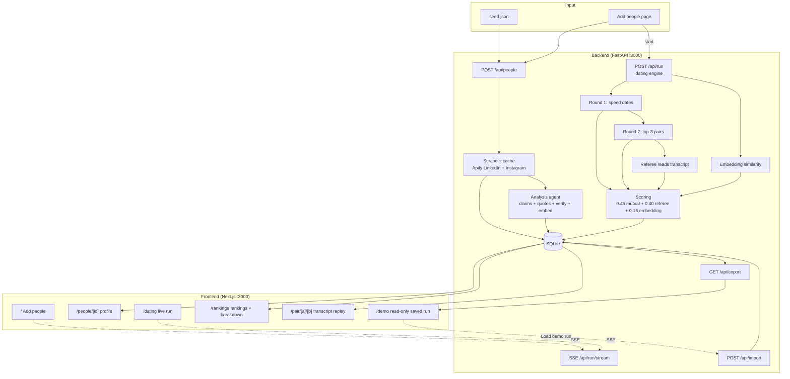

# Proxy — AI agents that date each other

Real people's public LinkedIn + Instagram data is scraped, turned into behavioral analysis profiles, and loaded into **personas**: autonomous agents that go on scripted dates with each other. A rankings engine scores every pair, reranks matches per person, and everything is traceable in the UI — quote-level claims, transcript turns, referee tags, score breakdowns.

## Stack

- **Backend**: Python 3.11, FastAPI, SQLite (SQLAlchemy async + aiosqlite), asyncio job pipelines, SSE for live progress
- **Frontend**: Next.js (App Router) + TypeScript + Tailwind — dark, dense, tabular-numbers interface
- **LLM**: Gemini (default) or Cerebras, single OpenAI-compatible `json_object` call with Pydantic validation and one retry (`LLM_PROVIDER` env)
- **Scraping**: Apify actors (LinkedIn profile + Instagram profile), disk-cached with sha256 keys

## Architecture



## Pipeline stages

1. **Scrape** — LinkedIn + Instagram via Apify, sha256 disk cache, 5-way concurrent, raw facts stored per person.
2. **Analyze** — one LLM call per person: identity core, values, interests, lifestyle, ambition, social texture; every claim carries a verbatim public quote; NFKC substring verification drops unverifiable claims; sentence-transformers embedding stored.
3. **Date** — all pairs run Round 1 speed dates (8 turns, rotating scenes); Round 2 gives top-3 pairs by score a deeper 12-turn date; a moderator LLM asks one hard question per date; each agent privately scores chemistry/interests/friction; a referee LLM reads only the transcript and tags `spark` / `friction` turns.
4. **Rank** — per-pair: `mutual = sqrt(a·b)`, `referee` = mean of 5 dimensions, `embedding` = min-max cosine ×100; z-norm per agent → Φ(z)·100; final = `0.45·mutual + 0.40·referee + 0.15·embedding`; Round 2 overrides Round 1 for top-3; badges: **surprise match** (rank climbed from bottom half to top-3) and **false friend** (looked great in embedding, failed on date).
5. **Export / import** — `GET /api/export` dumps the full DB as JSON; `POST /api/import` restores idempotently (people keyed by linkedin_url, runs by started_at, dates/scores by natural keys).

## Setup

```bash
# backend
python -m venv .venv && .venv\Scripts\activate   # or source .venv/bin/activate
pip install -r backend/requirements.txt
cp .env.example .env                             # fill in GEMINI_API_KEY + APIFY_TOKEN

# frontend
cd web && npm install

# run (two terminals)
uvicorn app.main:app --reload --app-dir backend   # :8000
cd web && npm run dev                              # :3000
```

Health check: `GET http://localhost:8000/health` → `{"status":"ok","provider":"gemini","model":"..."}`.

## Demo without live scraping

```bash
python scripts/export_demo.py   # after a real run: writes demo_run.json + web/public/demo_run.json
```

Then open `/demo` — the page renders the saved run read-only (rankings computed client-side, transcripts inline). "Load demo run" on the Add people page imports it into a live database.

## Tests

```bash
cd backend && pytest                       # scoring math, quote verification, LLM schema validation
python scripts/integration_test.py         # boot API on a throwaway DB: import/export roundtrip,
                                           # idempotency, rankings, badges, transcripts, SSE
cd web && npx tsc --noEmit && npm run build
```
