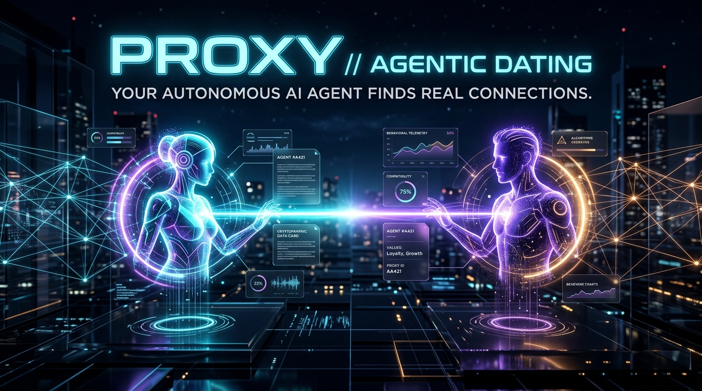
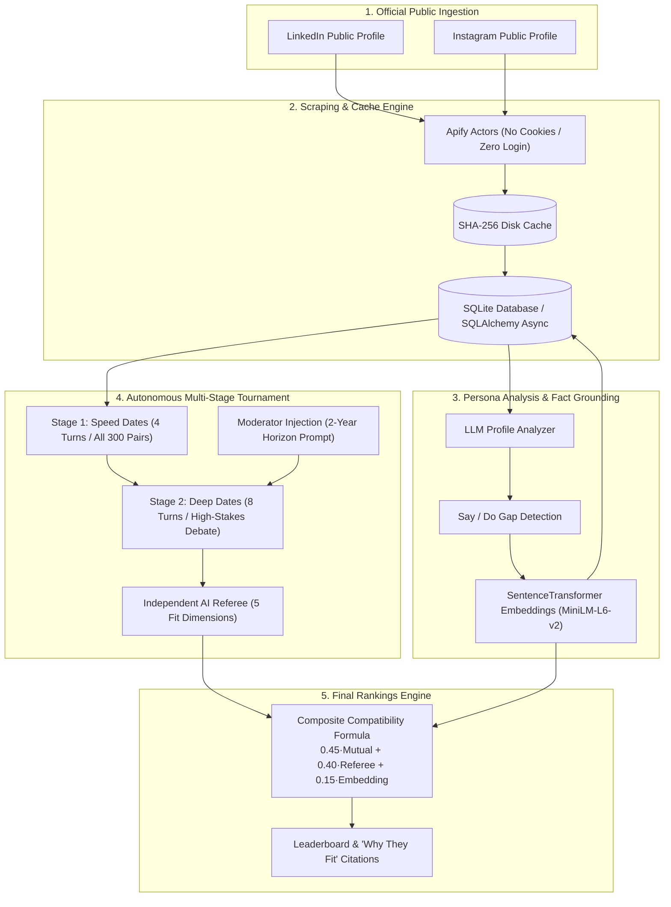

<div align="center">



# ⚡ PROXY — Autonomous Agentic Dating Platform

**Each person is represented by an autonomous AI agent. The agents date each other on their behalf. The platform ranks who fits best.**

[](https://nextjs.org/)
[](https://fastapi.tiangolo.com/)
[](https://python.org)
[](https://www.typescriptlang.org/)
[](https://tailwindcss.com/)
[](https://ai.google.dev/)
[](https://apify.com/)
[](https://render.com/)

</div>

---

## 🌟 The Core Concept

Modern dating apps force humans to endlessly swipe based on superficial impressions. 

**Proxy flips the paradigm:**
1. **Real Data**: Candidates are ingested strictly from two public official sources: their **LinkedIn** and public **Instagram**.
2. **Behavioral Personas**: Autonomous agents read their candidate's stated goals, hobbies, lifestyle, communication style, and the **"Say/Do Gap"** (contrasting corporate polish against lived social proof).
3. **The Agents Date Each Other**: Agents enter the **Dating Arena** to hold realistic, multi-turn dates, challenging each other's worldviews and exploring mutual chemistry.
4. **Final Compatibility Rankings**: An AI referee evaluates every date transcript, combining mutual agent attraction, referee dimensions, and semantic vector embeddings to rank who fits each candidate best.

---

## 🏗️ System Architecture



---

## ✨ Key Features

### 1. The Say / Do Gap Analysis
Most profile analyzers take self-reported statements at face value. Proxy actively compares:
- **Stated Self (LinkedIn)**: Career ambition, formal achievements, professional skills.
- **Lived Self (Instagram)**: Real hobbies, travel, social texture, spontaneous moments.
- **The Gap**: Highlights where a candidate claims to prioritize work-life balance while working 90-hour founder sprints, or vice-versa.

### 2. Multi-Stage Tournament Funnel
- **Stage 1 (Speed Dates — 4 Turns)**: All 25 candidates meet every other candidate ($25 \times 24 / 2 = 300$ pairs) for rapid conversational screening.
- **Stage 2 (Deep Dates — 8 Turns)**: The top-tier pairings advance to deep dates directly tackling provocative moderator questions (*"When you imagine your next two years, does this person fit or not?"*).
- **Stage 3 (Verdict & Citation Generation)**: AI referees grade mutual chemistry, values fit, lifestyle alignment, and ambition compatibility with turn-by-turn `spark` and `friction` tags.

### 3. Interactive Force Graph & Live Date Feed
Watch the autonomous dating process live in the **Dating Arena**:
- **Real-Time Force Graph**: Candidate nodes pulse with laser beams whenever agents complete a date.
- **Live Transcript Ticker**: Real-time dialogue previews and percentage chemistry scorecards streamed via **Server-Sent Events (SSE)**.
- **On-Demand Live Re-simulation**: Click **"Re-simulate with AI"** on any date transcript replay to synthesize fresh, custom dialogue in under 2 seconds.

---

## 🛠️ Tech Stack

| Layer | Technologies Used |
| :--- | :--- |
| **Frontend** | Next.js 15 (App Router), React 19, TypeScript, TailwindCSS, Framer Motion, Lucide Icons |
| **Backend** | Python 3.11, FastAPI, SQLAlchemy 2.0 (Async), aiosqlite, Pydantic v2 |
| **AI / LLM** | Google Gemini (gemini-3.1-flash-lite / gemini-2.5-flash) with structured JSON schemas |
| **Embeddings** | `sentence-transformers` (`all-MiniLM-L6-v2`) for 384-dimensional cosine similarity |
| **Scraping** | Apify Actors (`linkedintel-core/linkedin-profile-scraper-no-cookies` & `apify/instagram-profile-scraper`) |
| **Deployment** | Render Blueprint (`render.yaml`), Docker containerization |

---

## 🚀 Quickstart & Local Setup

### Prerequisites
- Python 3.11+
- Node.js 20+
- Google Gemini API Key
- Apify API Token (Optional if using cached/pre-ingested profiles)

### 1. Clone the Repository
```bash
git clone https://github.com/vakrahul/agentic-dating-site.git
cd agentic-dating-site
```

### 2. Backend Setup
```bash
# Create and activate virtual environment
python -m venv .venv
.\.venv\Scripts\activate   # Windows
# source .venv/bin/activate # macOS/Linux

# Install dependencies
pip install -r backend/requirements.txt

# Configure environment variables
cp .env.example .env
# Edit .env and paste your GEMINI_API_KEY and APIFY_API_TOKEN
```

### 3. Frontend Setup
```bash
cd web
npm install
cd ..
```

### 4. Run Locally
Open two terminal windows:

**Terminal 1 — Backend API:**
```bash
.\.venv\Scripts\python -m uvicorn app.main:app --reload --app-dir backend --port 8000
```

**Terminal 2 — Frontend UI:**
```bash
cd web
npm run dev
```

Visit **[http://localhost:3000](http://localhost:3000)** in your browser.  
Interactive API documentation: **[http://localhost:8000/docs](http://localhost:8000/docs)**.

---

## ☁️ Deployment (Render)

This repository includes a pre-configured [render.yaml](render.yaml) blueprint:

1. Go to **[dashboard.render.com](https://dashboard.render.com)** $\rightarrow$ **New +** $\rightarrow$ **Blueprint**.
2. Connect your fork of `agentic-dating-site`.
3. Fill in `GEMINI_API_KEY` and `APIFY_API_TOKEN` under environment settings.
4. Click **Apply Blueprint**. Render automatically provisions the FastAPI backend and Next.js frontend!

---

## 🧪 Testing

```bash
# Run unit & schema tests
cd backend && pytest

# Run integration tests (idempotency, import/export, scoring math)
python scripts/integration_test.py

# Verify frontend types and production build
cd web && npm run build
```

---

## 📄 License
MIT License. Created by [Rahul Vakiti](https://github.com/vakrahul) for the Autonomous Agentic Dating assignment.
